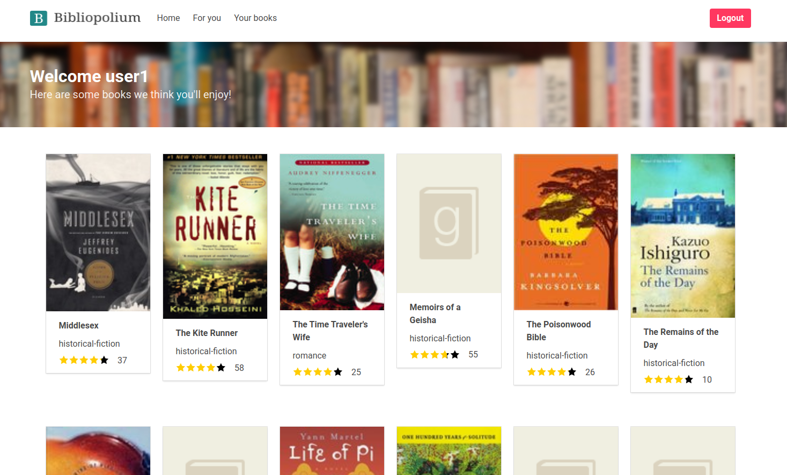

# Bibliopolium README

Welcome to my humble book rating website. It is built using Flask, supports
user registration and login with passwords and uses an SQLite database to store
all the book, user and rating data. Recommendations are made using a Singular
Value Decomposition technique on the ratings - for new users who have not
rated anything, the top rated books are presented as a default recommendation
until they rate a book. The website supports the addition and deletion of ratings
that will update the recommendations and an AJAX powered search bar that can
be used to search through all 10000 books.

The dataset used is the Goodbooks-10K dataset, hosted at <https://github.com/zygmuntz/goodbooks-10k>.

#

Instructions for use:

1. Clone the repo into a directory of your choice.

2. In the root directory of the project, install any Python requirements using:

        pip install -r requirements.txt

3. Populate the database by running:

        python populate_db.py

4. Run the website using:

        flask run

5. Navigate to localhost:5000 to check it out!

#

Useful info:

- For every user in the original CSV dataset, I've created a user account with the following details:

        username: user<user_id>
        password: letmein

For example, user with id 4 is now "user4" with password "letmein".
